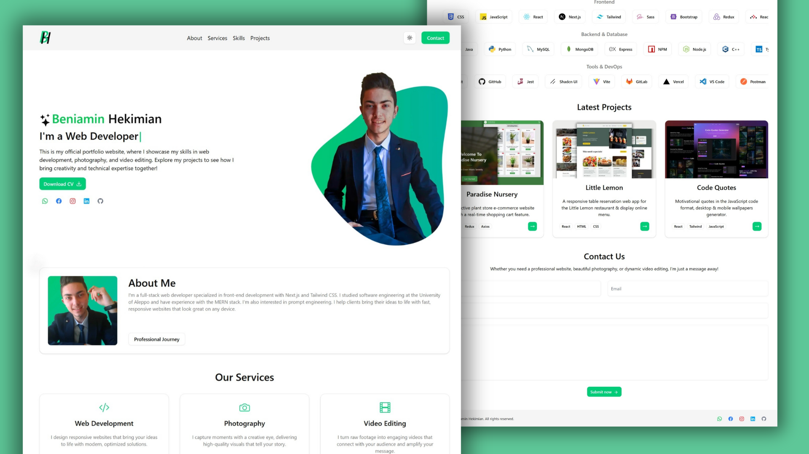

# Personal Portfolio Website 👨‍💻

A full-stack portfolio website built using **Next.js**, **Tailwind CSS**, and **Shadcn/ui**. This project showcases my abilities as a developer with a focus on clean UI, accessibility, and responsiveness.

## Live Preview 🌍

🔗 [Live Demo](https://beniamin-hekimian.github.io)

## Features ✅

1. Interactive showcase of my development skills and background.
2. Button to download my **resume** directly from the homepage.
3. Integrated **social links** to GitHub, LinkedIn, and more.
4. Responsive **contact form** for direct communication.
5. **Dark theme** toggle powered by `next-themes`.

## Mockup 📸

## What I Learned 📚

1️⃣ **Next.js Framework:**
   - Built a performant and SEO-friendly website using the App Router.
   - Implemented layout management and dynamic metadata.

2️⃣ **Tailwind CSS:**
   - Designed a fully responsive layout with utility-first classes.
   - Created consistent styling without writing custom CSS.

3️⃣ **Shadcn/ui:**
   - Utilized accessible and customizable components.
   - Learned to integrate third-party UI libraries into a modern React/Next.js workflow.

4️⃣ **Dark Mode Support:**
   - Implemented theme switching using `next-themes`.
   - Preserved user preference across sessions.

5️⃣ **Accessibility & UX:**
   - Focused on keyboard navigation and ARIA-friendly components.
   - Improved user experience with smooth interactions and visual consistency.

## Technologies Used 🛠️

- 🎯 Next.js (App Router)
- 🎨 Tailwind CSS
- 🧩 Shadcn/ui
- 🌙 next-themes
- 💡 web3forms
- 🚀 GitHub Pages

## Conclusion 🎉

Developed by **Beniamin Hekimian**.

Feel free to reach out! ✉️
